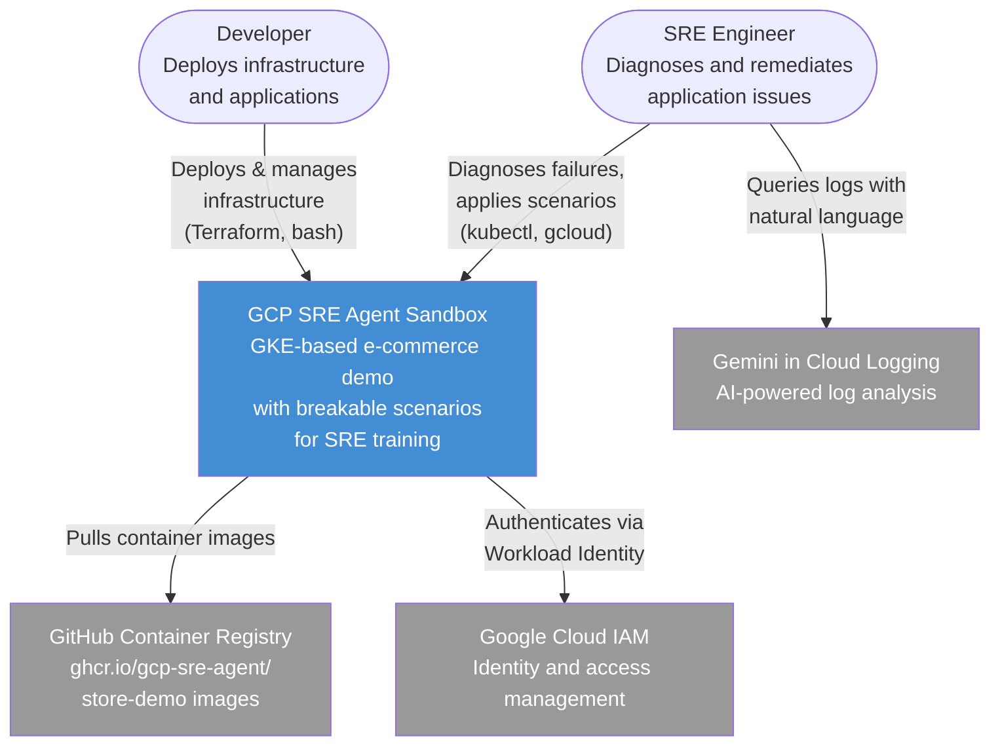
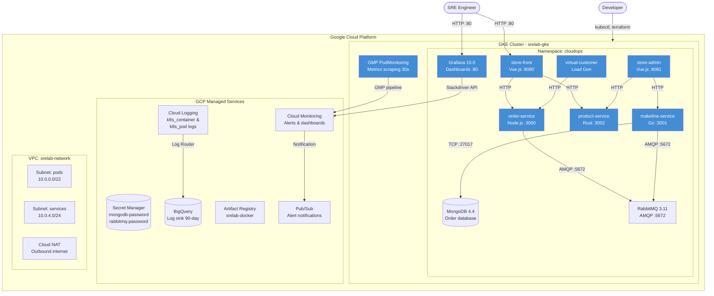
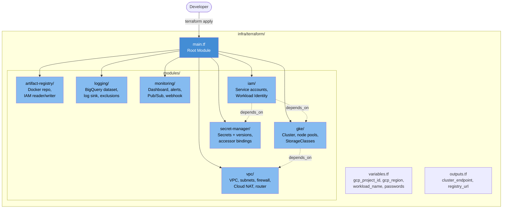
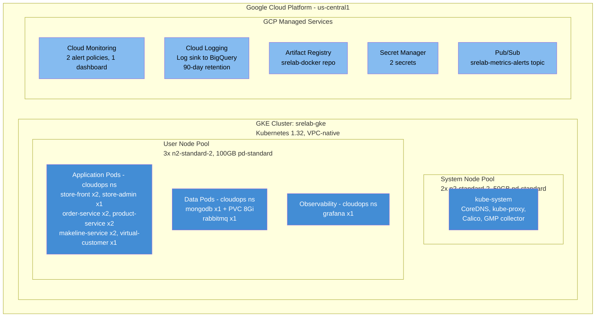

# GCP SRE Agent Sandbox - Architecture Diagrams

## Level 1: System Context Diagram



## Level 2: Container Diagram



## Level 3: Component Diagram - Terraform Modules



## Level 4: Deployment Diagram



## Network Topology

```
+------------------------------------------------------------------+
|  VPC: srelab-network                                             |
|                                                                  |
|  +---------------------------+  +---------------------------+    |
|  | Subnet: pods              |  | Subnet: services          |    |
|  | 10.0.0.0/22               |  | 10.0.4.0/24               |    |
|  |                           |  |                           |    |
|  | Secondary ranges:         |  | Flow logs: enabled        |    |
|  |   pods:     10.1.0.0/16   |  +---------------------------+    |
|  |   services: 10.2.0.0/16   |                                  |
|  |                           |                                  |
|  | Flow logs: enabled        |                                  |
|  +---------------------------+                                  |
|                                                                  |
|  Firewall Rules:                                                 |
|  +---------------------------+  +---------------------------+    |
|  | allow-internal (pri:1000) |  | allow-ssh (pri:1001)      |    |
|  | TCP/UDP 0-65535           |  | TCP 22                    |    |
|  | src: pod + svc CIDRs      |  | src: 0.0.0.0/0            |    |
|  +---------------------------+  +---------------------------+    |
|                                                                  |
|  Cloud NAT: srelab-network-nat (AUTO_ONLY, all subnets)          |
|  Cloud Router: srelab-network-router                             |
+------------------------------------------------------------------+
         |                    |                    |
    [LoadBalancer]       [LoadBalancer]       [LoadBalancer]
    store-front:80       store-admin:80       grafana:80
```
