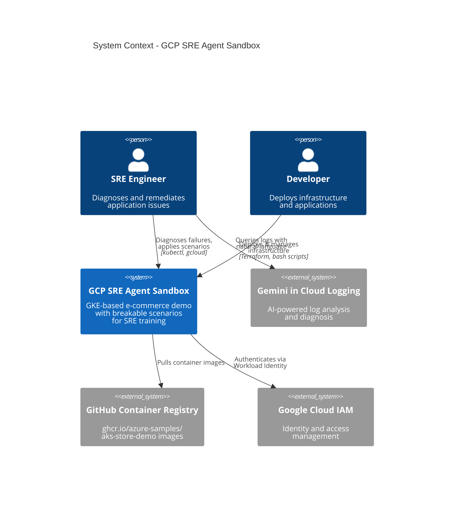
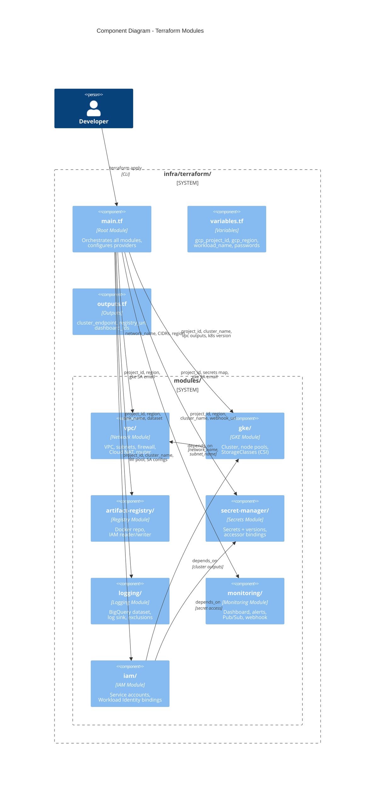
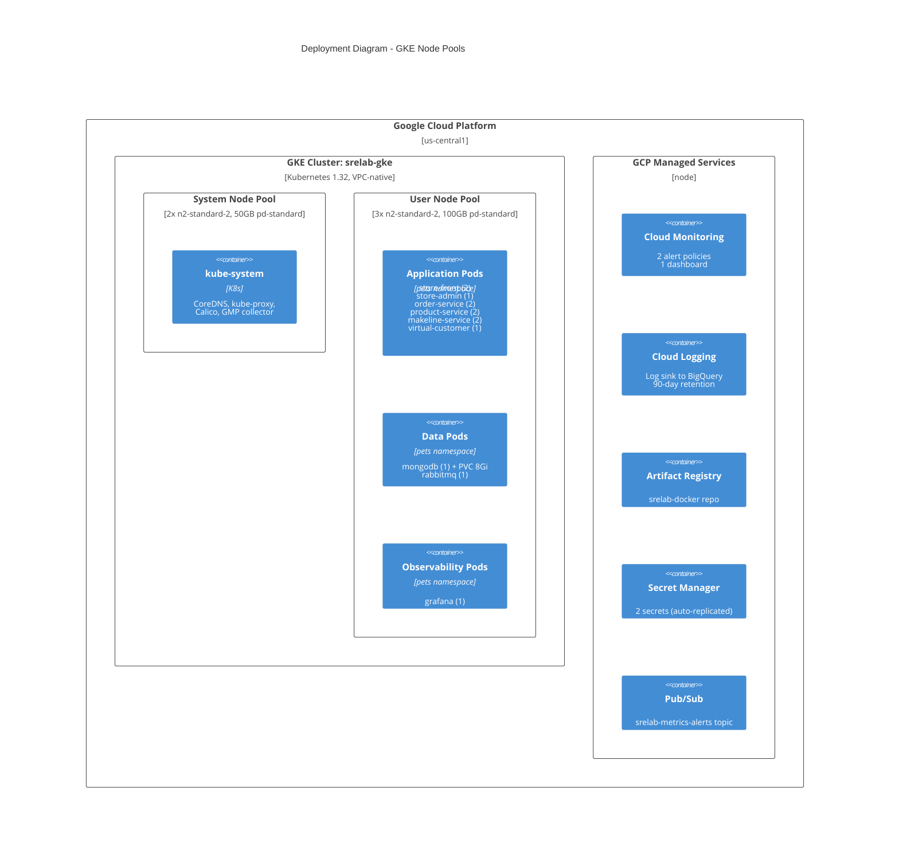

# GCP SRE Agent Sandbox - C4 Architecture Diagrams

## Level 1: System Context Diagram



## Level 2: Container Diagram

```mermaid
C4Container
    title Container Diagram - GCP SRE Agent Sandbox

    Person(sre, "SRE Engineer")
    Person(dev, "Developer")

    System_Boundary(gcp, "Google Cloud Platform") {

        System_Boundary(gke, "GKE Cluster (srelab-gke)") {

            System_Boundary(pets_ns, "Namespace: pets") {
                Container(storefront, "store-front", "Vue.js", "Customer-facing<br/>web UI :8080")
                Container(storeadmin, "store-admin", "Vue.js", "Admin panel :8081")
                Container(orderservice, "order-service", "Node.js", "Order processing :3000")
                Container(productservice, "product-service", "Rust", "Product catalog :3002")
                Container(makelineservice, "makeline-service", "Go", "Order fulfillment :3001")
                Container(virtualcustomer, "virtual-customer", "Load Gen", "Simulates traffic")
                ContainerDb(mongodb, "MongoDB", "MongoDB 4.4", "Order database<br/>PD: standard-rwo")
                Container(rabbitmq, "RabbitMQ", "RabbitMQ 3.11", "Message queue<br/>AMQP :5672")
                Container(grafana, "Grafana", "Grafana 10.0", "Dashboards :3000<br/>LB :80")
            }

            Container(gmp, "GMP PodMonitoring", "CRDs", "Metrics scraping<br/>30s interval")
        }

        System_Boundary(infra, "GCP Managed Services") {
            ContainerDb(secretmgr, "Secret Manager", "GCP", "mongodb-password<br/>rabbitmq-password")
            Container(cloudlogging, "Cloud Logging", "GCP", "k8s_container &<br/>k8s_pod logs")
            ContainerDb(bigquery, "BigQuery", "GCP", "Log sink dataset<br/>90-day retention")
            Container(cloudmon, "Cloud Monitoring", "GCP", "Alert policies<br/>& dashboards")
            Container(artifactreg, "Artifact Registry", "GCP", "Docker repo:<br/>srelab-docker")
            Container(pubsub, "Pub/Sub", "GCP", "Alert notifications")
        }

        System_Boundary(network, "VPC: srelab-network") {
            Container(subnet_pods, "Subnet: pods", "10.0.0.0/22", "Pod networking")
            Container(subnet_svc, "Subnet: services", "10.0.4.0/24", "Service networking")
            Container(nat, "Cloud NAT", "Router", "Outbound internet")
        }
    }

    Rel(sre, storefront, "Browses store", "HTTP :80 LB")
    Rel(sre, grafana, "Views dashboards", "HTTP :80 LB")
    Rel(dev, gke, "Manages cluster", "kubectl, terraform")
    Rel(storefront, orderservice, "Places orders", "HTTP")
    Rel(storefront, productservice, "Lists products", "HTTP")
    Rel(storeadmin, productservice, "Manages products", "HTTP")
    Rel(storeadmin, makelineservice, "Views orders", "HTTP")
    Rel(orderservice, rabbitmq, "Publishes orders", "AMQP :5672")
    Rel(makelineservice, rabbitmq, "Consumes orders", "AMQP :5672")
    Rel(makelineservice, mongodb, "Stores orders", "TCP :27017")
    Rel(virtualcustomer, orderservice, "Generates load", "HTTP")
    Rel(cloudlogging, bigquery, "Sinks logs", "Log Router")
    Rel(cloudmon, pubsub, "Fires alerts", "Notification Channel")
    Rel(grafana, cloudmon, "Queries metrics", "Stackdriver API")
    Rel(gmp, cloudmon, "Exports metrics", "GMP pipeline")
```

## Level 3: Component Diagram (Infrastructure as Code)



## Level 4: Deployment Diagram



## Network Topology

```
+------------------------------------------------------------------+
|  VPC: srelab-network                                             |
|                                                                  |
|  +---------------------------+  +---------------------------+    |
|  | Subnet: pods              |  | Subnet: services          |    |
|  | 10.0.0.0/22               |  | 10.0.4.0/24               |    |
|  |                           |  |                           |    |
|  | Secondary ranges:         |  | Flow logs: enabled        |    |
|  |   pods:     10.1.0.0/16   |  +---------------------------+    |
|  |   services: 10.2.0.0/16   |                                  |
|  |                           |                                  |
|  | Flow logs: enabled        |                                  |
|  +---------------------------+                                  |
|                                                                  |
|  Firewall Rules:                                                 |
|  +---------------------------+  +---------------------------+    |
|  | allow-internal (pri:1000) |  | allow-ssh (pri:1001)      |    |
|  | TCP/UDP 0-65535           |  | TCP 22                    |    |
|  | src: pod + svc CIDRs      |  | src: 0.0.0.0/0            |    |
|  +---------------------------+  +---------------------------+    |
|                                                                  |
|  Cloud NAT: srelab-network-nat (AUTO_ONLY, all subnets)          |
|  Cloud Router: srelab-network-router                             |
+------------------------------------------------------------------+
         |                    |                    |
    [LoadBalancer]       [LoadBalancer]       [LoadBalancer]
    store-front:80       store-admin:80       grafana:80
```
